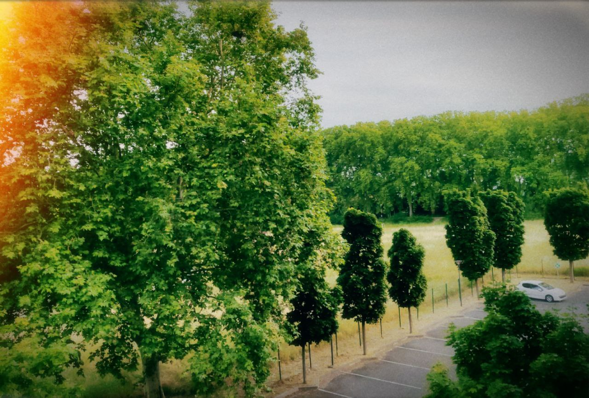

September 22, 2024

Journey to the Edge of Reason

in spaces lie hidden paths.  
it flows like water along invisible cracks.  
the beauty, it rests in the shadows,  
and where do they come from?  
i don’t know, but they sleep everywhere. 
their only word was “you will find out”  
 
i have told you once, and i will tell you once again,  
there is always something peculiar,<b> [*]</b>  
between even things and two times of something,  
among all of that, what remains?  
perhaps just a feeling.  
of the shape,  
of the warmth that it gives me, 
through wild intuition,  
of a young man,  
standing on a broken ancient ruin.  
in the eyes of beauty  
i sleep again  
 

[*] <small>ref: n < p < 2n [Bertrand-Chebyshev theorem](https://en.wikipedia.org/wiki/Bertrand%27s_postulate) </small>  

<small> <i>"there is always a prime number between n and 2n"</i>   </small>

<small>
[**] : I borrowed the title from Budiansky's book on Gödel
</small>

June 6, 2024

> Own only what you can always carry with you: know languages, know countries, know people. Let your memory be your travel bag. Look around you and realize what you have around you. Maybe you will remember one of them all your life and later eat your heart out because you didn't make use of the opportunity to ask questions. And the less you talk, the more you'll hear  
> —<cite>Aleksandr Solzhenitsyn, The Gulag Archipelago</cite> >  
