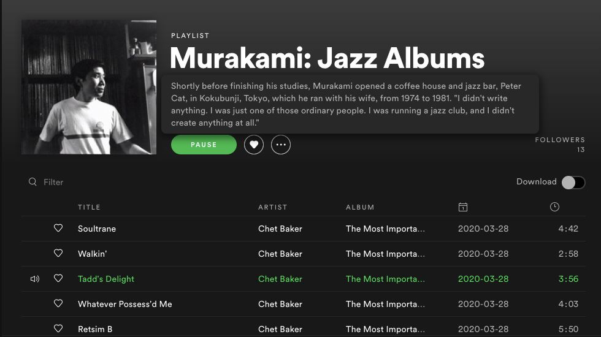

> Sometimes. Jazz is a journey for me, 
> a mental journey. No different than writing  
> ––<cite>Haruki Murakami</cite>

Haruki Murakami is a jazz aficionado, he has been collecting about 10,000 jazz vinyl records — the long explanation in [Open Culture](https://www.openculture.com/2014/07/haruki-murakamis-passion-for-jazz.html). That’s quite obvious for his reader since he often puts jazz nuances into his stories. The above article also provides the link to a [Youtube playlist](https://www.youtube.com/playlist?list=PLhZsEks2qBMoy7gD0PZQSGguiYcuEFDCs) of jazz pieces based on Murakami’s essay ‘Portrait in Jazz’. I’ve also found that there is someone on Spotify who makes an effort to assemble more comprehensive collections (search: Murakami Jazz).

<iframe
  src="https://open.spotify.com/embed/playlist/3qzJhVyFTYGTknXCDr5tdF"
  width="600"
  height="100"
  frameborder="0"
  allowtransparency="true"
  allow="encrypted-media"
/>
