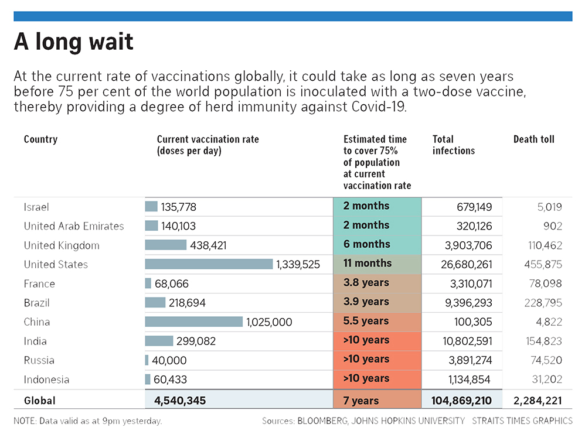
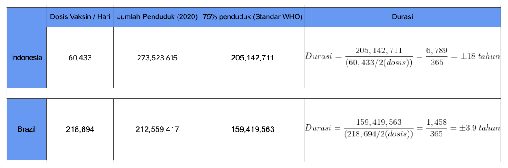
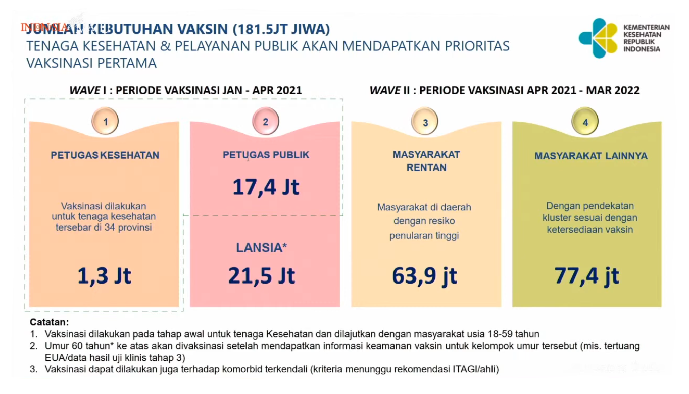

Sebagian besar dari kita mungkin telah melihat tabel estimasi vaksinasi dari Bloomberg - John Hopkins University yang dipublikasi oleh media [The Strait Time](https://www.straitstimes.com/world/pandemic-could-end-in-7-years-at-current-pace-of-vaccination) berseliweran di media sosial. Kemudian selang beberapa hari disusul reaksi dari beberapa otoritas Indonesia terkait prediksi tersebut.

Kurang ekuivalen agaknya jika membandingkan Israel yang penduduknya ± 9.2 juta jiwa, dengan Indonesia yang penduduknya ± 273 juta jiwa. Agar sedikit lebih sepadan saya coba membandingkan dengan Brazil yang penduduknya ± 212 juta jiwa.

Jika ingin menelan data ini mentah-mentah tentu pahit rasanya melihat durasi selama itu untuk mencapai batas 75% vaksinasi, bahkan jika dosis dinaikkan hingga 4 kali lipat setara Brazil, Indonesia masih perlu 4.6 tahun untuk menyelesaikan 75% vaksinasi.

Pada awal tahun Kemenkes sebenarnya sudah mengeluarkan panduan vaksinasi hingga Maret 2022, dengan target 181.5 juta jiwa (± 66% penduduk Indonesia) di mana dosis hariannya belum saya ketahui jumlahnya. Jika kita ambil total hari hingga akhir Maret 2022 sebesar 454 maka jumlah rata-rata dosis harian Kemenkes saat ini seharusnya sebesar:

$$
454 \ hari = \frac{181.500.000}{x/2} = 799.599 \ dosis
$$

Jika data vaksinasi harian Bloomberg diperoleh dari otoritas resmi di Indonesia, artinya dosis harian Indonesia saat ini 13 kali lebih sedikit dari rata-rata vaksin harian yang seharusnya. Dengan demikian dapatlah dikatakan bahwa rencana Kemenkes di atas kurang realistis, dengan pengecualian jika sewaktu-waktu ada jutaan vaksin dan vaksinator yang tersedia di tengah jalan untuk menambal kekurangan sebelumnya.

 
