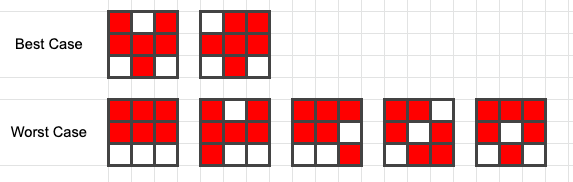
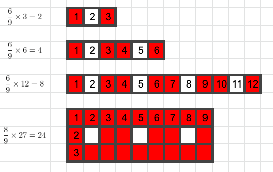
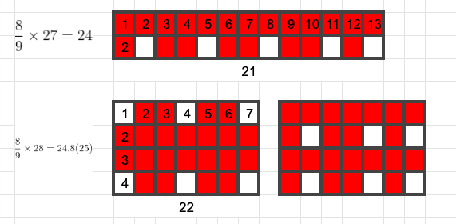
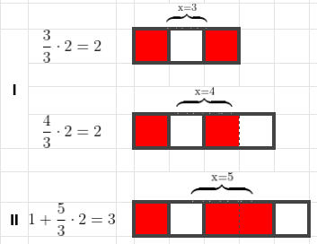
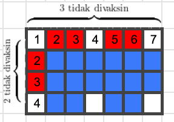

Minggu pagi lalu, saat sedang joging, saya berpapasan dengan seorang remaja bermotor yang menenteng sangkar berisi burung merpati di tangan kirinya, dari kejauhan saya melihatnya berhenti di ujung jalanan yang sepi, kemudian dia melepaskan dan mengamati merpatinya, tak terlihat sedikitpun keraguan jika sekonyong-konyongnya burung itu melarikan diri. Mereka semacam sedang mengasah kemampuan telepati untuk memantapkan ikatan simbiosis satu sama lain. Saat sedang menikmati pemandangan itu, seketika saya teringat dengan prinsip sarang burung merpati (_Pigeonhole principle_) yang pernah saya baca beberapa tahun lalu. Seketika juga saya teringat dengan masalah vaksinasi Kemenkes sebelumnya.

<center>• • • • •</center>

[_Pigeonhole principle_](https://en.wikipedia.org/wiki/Pigeonhole_principle) yang lebih umum dikenal dengan nama _Dirichlet's box principle_, adalah sebuah prinsip matematika yang terinspirasi dari sarang burung merpati di mana jika sejumlah **_n_** burung diletakkan ke dalam **_m_** kontainer di mana **_n_** > **_m_**, maka sedikitnya satu kontainer harus berisi lebih dari satu item. Ide dasar prinsip ini memang sesederhana itu namun impelementasinya bisa beragam, mulai dari algoritma untuk optimasi pergerakan, hingga algoritma kompresi.


<figcaption align = "center">10 merpati dalam 9 lubang</figcaption>

<center>• • • • •</center>

Jika konsep di atas kita bayangkan dalam kerangka _Herd Immunity_ (kekebalan kelompok) sebagai contoh sederhana terhadap orang yang divaksin (merah) dan tidak divaksin (putih), lalu dipetakan kedua kelompok tersebut ke dalam kotak 3×3 dengan proporsi $^6/_9$ maka akan diperoleh variasi best case dan worst case seperti gambar di bawah, yang berarti 3 orang yang tidak divaksin pada kasus terbaiknya akan memperoleh perlindungan hingga 66% dari 6 orang yang divaksin.



Lebih lanjut jika kita menginginkan imunitas kelompok yang lebih optimal dengan kerangka yang sama di mana setiap orang dapat berinteraksi paling sedikit ke satu orang yang belum divaksin secara horizontal, vertikal, atau diagonal maka ada 8 dari 9 orang yang divaksin (gbr A). Namun, jika kerangka ini kita jejerkan kebentuk horizontal/vertikal 1×9, jumlah orang yang divaksin dengan kriteria serupa hanya 6 dari 9 orang (gbr B). Gambar C belum memenuhi kriteria optimal karena masih dapat dioptimasi seperti pada gambar B.


Dengan pemahaman dari kotak 3×3 atau 1×9 di atas, secara intuitif harusnya kita sudah dapat menemukan pengali untuk memperoleh jumlah kotak optimal pada kotak berdimensi lain. contoh:



Namun, kedua pengali di atas hanya cocok digunakan pada kasus terbatas ketika dimensi kotak memiliki kelipatan yang sama atau berdimensi (baris atau kolom) satu dengan sisa pembagian 0 atau 1.



Pada contoh kotak berdimensi 2×13 atau 4×7, pengali $^8/_9$ tidak menghasilkan jawaban yang tepat karena jawaban yang seharusnya adalah 21 untuk 2×13 dan 22 untuk 4×7.

<center>• • • • •</center>



Untuk menyederhanakan permasalahan sebelumnya, lewat gambar di atas kita coba rumuskan kondisi umum dari kotak satu baris dan x kolom. Sesuai dengan persyaratan awal yang kita ajukan di mana <b>setiap orang 🟥 berinteraksi paling sedikit ke satu orang ⬜ </b>, maka setiap ada 2 orang 1 di antaranya harus divaksin, demikian juga jika ada 3 orang, akan selalu ada 2 orang yang divaksin.

Pada kondisi (I) di mana x=3 dan x=4 jumlah orang yang divaksin sama sehingga dapat kita rumuskan bahwa ketika $^x/_3$ bersisa 0 atau 1 maka banyaknya orang yang divaksin adalah hasil bagi $^x/_3$ kali 2.

Pada kondisi (II) di mana x=5 jumlah orang yang divaksin adalah 2 orang dari 3 kelompok pertama ditambah 1 dari 2 kelompok kedua sehingga dapat kita rumuskan bahwa ketika $^x/_3$ sisanya > 1 maka banyaknya orang yang divaksin adalah 1 + hasil bagi $^x/_3$ kali 2.

Rumusan selengkapnya seperti ditunjukkan fungsi g(x) berikut

$$
g(x) = \begin{cases}
\frac{x}{3} \cdot 2 & \text{jika  \ x mod 3 = 0 || x mod 3 = 1} \\
1 + \frac{x}{3} \cdot 2 & \text{jika \ x mod 3 > 1}
\end{cases}
$$

<center>• • • • •</center>

Sejauh ini kita sudah mempunyai ide untuk mendapatkan jumlah orang yang harus divaksin pada konstruksi baris atau kolom berdimensi 1. Selanjutnya, untuk konstruksi berdimensi lebih besar kita membutuhkan pendekatan lain yang masih berbasis pada kondisi baris atau kolom berdimensi 1.



Dengan melihat sekilas pada baris dan kolom pertama pada gambar di atas, terdapat 3 orang yang tidak divaksin pada baris pertama, dan 2 orang yang tidak divaksin pada kolom pertama yang jika kita refleksikan akan menghasilkan jumlah keseluruhan orang yang tidak divaksin, dengan kata lain keseluruhan jumlah orang yang tidak divaksin adalah perkalian antara jumlah orang yang tidak divaksin pada baris dan kolom pertama, demikian kita mendapatkan jumlah orang yang divaksin dengan mengurangkan perkalian baris kolom keseluruhan dengan hasil perkalian baris kolom orang yang tidak divaksin, di mana untuk mendapatkan jumlah orang yang tidak divaksin kita dapat mengurangkan masing-masing baris/kolom dengan hasil dari fungsi g(x).

Rumusan selengkapnya seperti ditunjukkan fungsi f berikut

$$
f(baris(b), kolom(k)) = \begin{cases}
0 & \text{jika \ $b\cdot k = 1$}\\
g(b\cdot k) & \text{jika \ $b=1$ atau $k=1$} \\
b\cdot k - ((b-g(b))\cdot (k-g(k))) & \text {jika \ $b \cdot k$ $>$ $1$}
\end{cases}
$$

<center>• • • • •</center>
<br />

Agar lebih interaktif, pada program sederhana di bawah telah saya implementasikan algoritma dari persamaan fungsi f dan g sebelumnya.

<center>
<iframe height="300" style="width: 75%;" scrolling="no" title="Herd Immunity" src="https://codepen.io/nniinnoo/embed/YzpYYYb?height=265&theme-id=dark&default-tab=result" frameborder="no" loading="lazy" allowtransparency="true" allowfullscreen="true">
  See the Pen <a href='https://codepen.io/nniinnoo/pen/YzpYYYb'>Herd Immunity</a> by Nino
  (<a href='https://codepen.io/nniinnoo'>@nniinnoo</a>) on <a href='https://codepen.io'>CodePen</a>.
</iframe>
</center>

Sebagai contoh sederhana jika kita ambil contoh dari populasi penduduk Indonesia tahun 2020 -- sebanyak 273.523.615, lalu kita ujikan dalam 2 skenario berbeda di mana:

- **A** : Penduduk dijejerkan dalam satu baris (1×273.523.615)
- **B** : Penduduk dipetakan dalam bidang simetris 16538×16538 (√ 273.523.615)

Maka akan didapat hasil masing-masing:

- 182.349.076 orang (67% populasi) pada percobaan A
- 243.112.275 orang (89% populasi) pada percobaan B
- Dengan rataan A & B sebesar 212.730.675 orang (78% populasi)

<center>• • • • •</center>

<div class="filename">full code</div>

```js
function calculate_bk(x) {
  let result;
  let chunkRes = x % 3;

  if (chunkRes == 0 || chunkRes == 1) {
    result = Math.floor(x / 3) * 2;
  } else {
    result = 1 + Math.floor(x / 3) * 2;
  }

  return result;
}

function process(b, k) {
  let count = 0;
  let fb = calculate_bk(b);
  let fk = calculate_bk(k);
  let dimension = b * k;

  if (dimension == 1) {
    count = 0;
  } else if (b == 1) {
    count = fk;
  } else if (k == 1) {
    count = fb;
  } else {
    count = dimension - (b - fb) * (k - fk);
  }

  return count;
}

function herd_immunity(b, k) {
  let result = process(b, k);

  return result;
}
```
